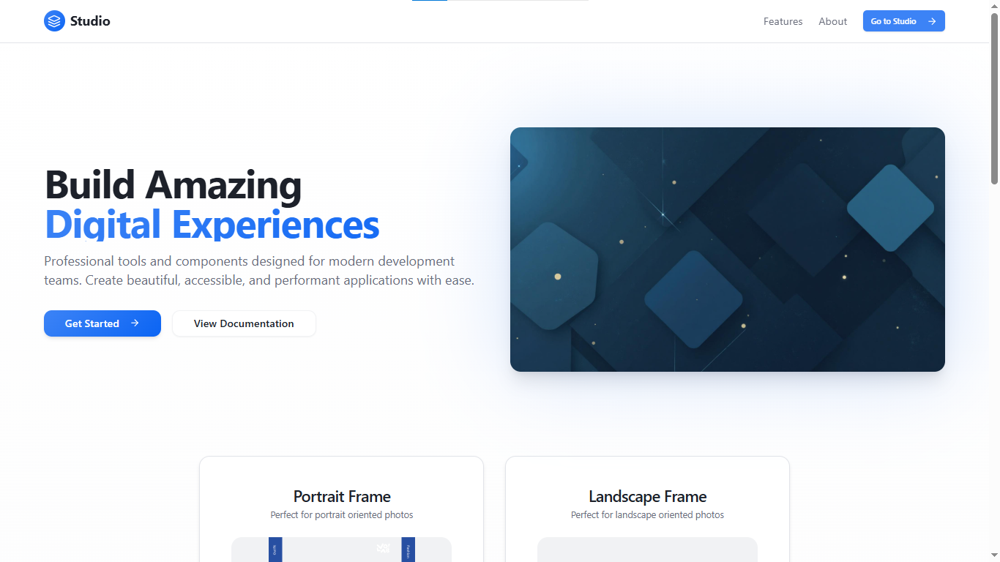
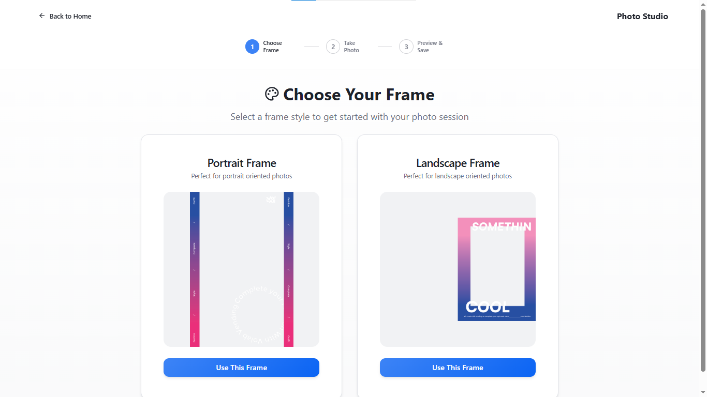
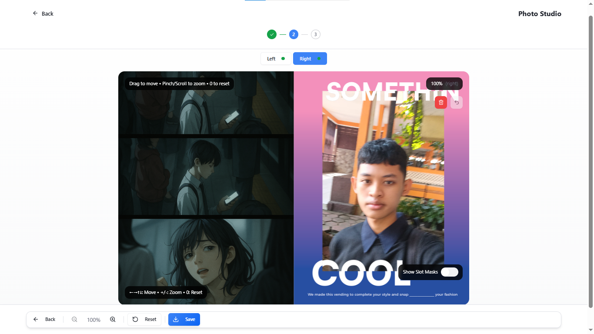

<p align="center">
  
</p>

<h1 align="center">📸 Volab Studio</h1>

<p align="center">
  Aplikasi web untuk ambil foto dengan frame kiri & kanan, lalu bisa langsung di-export.<br/>
  Dibuat dengan stack modern supaya ringan & gampang dipakai.
</p>

<p align="center">
  
  
  
  
  
</p>

---

## ✨ Fitur Utama

- **Dual Slot Landscape** - Foto terbagi kiri & kanan dengan frame khusus
- **Portrait Mode** - Mode single photo untuk potret
- **WYSIWYG Camera** - Preview sama persis dengan hasil akhir
- **Export Konsisten** - Hasil export PNG/JPEG identik dengan preview
- **Responsif** - Bekerja baik di desktop dan mobile

---

## 🚀 Tech Stack

- **TypeScript** – bahasa utama
- **React** – frontend framework
- **Tailwind CSS** – styling modern
- **shadcn/ui** – komponen UI
- **Vercel** – hosting & deployment

---

## 🛠️ Cara Jalankan

1. Clone repository:

```bash
git clone <url-repo>
cd <nama-folder>
```

2. Install dependencies:

```bash
npm i
```

3. Jalankan aplikasi:

```bash
npm run dev
```

Buka di browser: http://localhost:3000

---

## 🌐 Deployment

Deploy sangat mudah via Vercel:

1. Push repo ke GitHub
2. Connect ke vercel.com
3. Done ✅

---

## 📷 Preview


*Halaman Landing*


*Halaman Stepper*


*Halaman Canvas*

---

## 📂 Struktur Project

```
src/
├── components/     # Komponen React
├── hooks/         # Custom hooks
├── lib/           # Utilities & constants
├── types/         # TypeScript definitions
└── styles/        # File styling
```

---

## ⚙️ Konfigurasi

File `src/lib/slots.ts` berisi pengaturan frame:

```typescript
export const RIGHT_SAFE = {
  x: 550,
  y: 100,
  width: 300,
  height: 400
};

export const LEFT_SLOT = {
  x: 0,
  y: 0,
  width: 500,
  height: 600
};
```

---

## 📖 Catatan

- Pastikan kamera/permission aktif
- Support mode portrait & landscape
- Export hasil foto identik dengan preview
- Kompatibel dengan berbagai browser modern

---

## 🐛 Melaporkan Masalah

Jika menemukan bug atau memiliki saran, silakan buat issue di repository ini.

## 🤝 Berkontribusi

Kontribusi selalu diterima! Silakan fork repository ini dan buat pull request dengan perubahan Anda.

---

**Happy Coding! 📷✨**